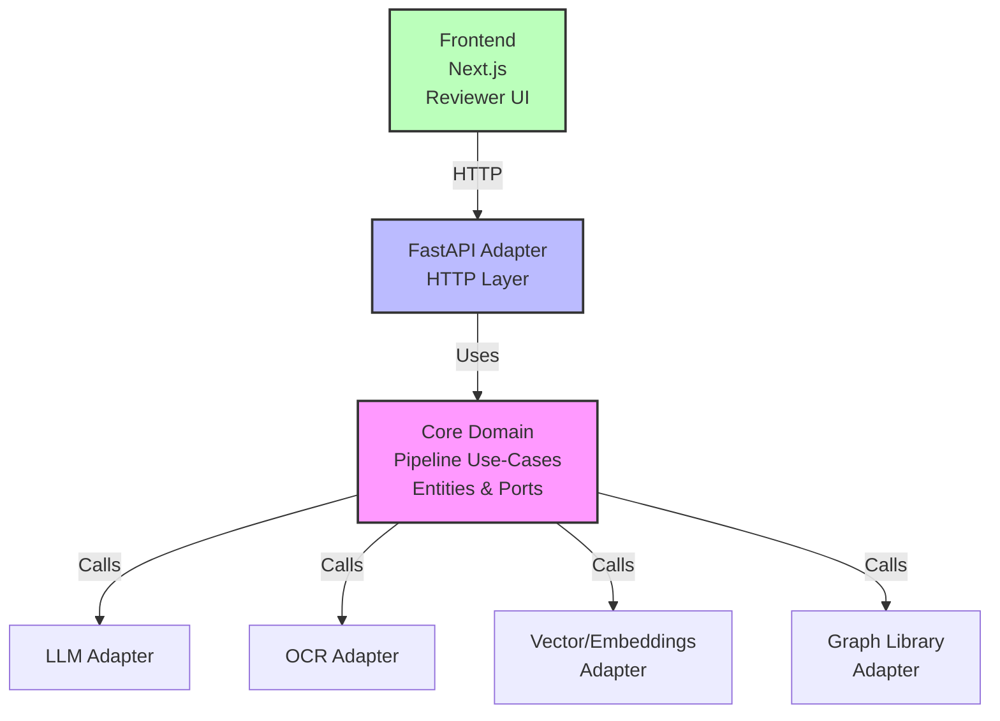

# Zetarix

> Open-source AI pipeline that automates ~80% of the UN ESCAP **RDTII** (Regional Digital
> Trade Integration Index) digital-trade
> regulatory workflow — **discover → describe** — across Asia-Pacific jurisdictions, leaving
> the final ~20% for transparent human review.
>
> Built by **Team Arkova** for the **Global Hackathon on AI for Digital Trade
> Regulatory Analysis** (UN ESCAP & KMITL, 2026). Licensed under **Apache 2.0**.

Mandatory scope: **Pillar 6 (Cross-border Data Flows)** + **Pillar 7 (Domestic Data
Protection)**, at article-level granularity with the 6 mandatory fields.

## Why "model-agnostic"

Built on **ports & adapters (hexagonal) architecture**. The core domain depends only on
interfaces; every AI model (LLM, OCR, captioner, embeddings, graph library) is a **swappable
suggestion**, changed via config without touching the domain. Swappability is heavily scored
(20 pts Stage 1 + 20 pts Stage 3).

## Pipeline (5 stages)

```
discover → OCR + SigLIP-style captioning → tag + extract → human review → concept graph
```

The concept-graph stage connects tagged sections into a weighted, pruned graph
(community detection + FCA generality hierarchy + PageRank) — the core architectural
contribution. See [backend/docs/GRAPH_PIPELINE.md](backend/docs/GRAPH_PIPELINE.md).

## Monorepo layout

```
.
├── backend/    # Framework-agnostic core (ports/domain/pipeline) + FastAPI reference adapter
│   ├── core/        # AGNOSTIC: ports (interfaces), entities, pipeline use-cases
│   ├── adapters/    # Concrete LLM / OCR / vector / graph implementations — swap here
│   ├── app/         # FastAPI reference adapter (thin HTTP layer)
│   └── docs/        # ARCHITECTURE, REQUIREMENTS (Q&A-traced), GRAPH_PIPELINE, TECHNICAL_MEMO
├── frontend/   # Next.js reviewer / audit UI for non-technical users
└── docs/       # Project-level docs (PROPOSAL)
```

## Key documents

- [docs/PROPOSAL.md](docs/PROPOSAL.md) — full project proposal
- [docs/COMPLIANT_AUTOMATION_GUIDE.md](docs/COMPLIANT_AUTOMATION_GUIDE.md) — compliance-first automation, OSI-style observability, and AI coding guidelines
- [backend/docs/ARCHITECTURE.md](backend/docs/ARCHITECTURE.md) — ports & adapters design
- [backend/docs/REQUIREMENTS.md](backend/docs/REQUIREMENTS.md) — requirements traced from the Q&A
- [backend/docs/GRAPH_PIPELINE.md](backend/docs/GRAPH_PIPELINE.md) — concept-graph model
- [backend/docs/TECHNICAL_MEMO.md](backend/docs/TECHNICAL_MEMO.md) — submission memo (≤2 pages)

## License

[Apache License 2.0](backend/LICENSE).

## Architecture (UML)



**Tech Stack**: Python, FastAPI, Next.js, model-agnostic (swappable LLM/OCR/embeddings)

**Getting Started**: See [backend/docs/ARCHITECTURE.md](backend/docs/ARCHITECTURE.md) and [docs/PROPOSAL.md](docs/PROPOSAL.md).