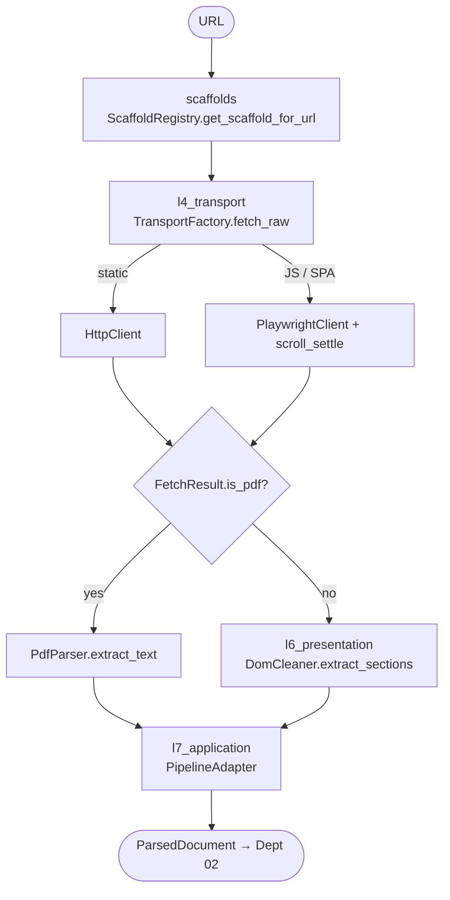

# `adapters/botting/` — The Scraper Stack

Everything about **how a URL becomes clean, structured sections**. Organized as a
three-layer stack (named after OSI layers) plus a plug-in scaffold registry. Implements
the fetch ports; never imports extraction/scoring/clustering.

## Layers

| Folder | OSI analogy | Responsibility |
|---|---|---|
| [`l4_transport/`](l4_transport/README.md) | L4 | get the bytes (HTTP, headless browser, proxies, PDF) |
| [`l6_presentation/`](l6_presentation/README.md) | L6 | clean HTML → anchored sections |
| [`l7_application/`](l7_application/README.md) | L7 | orchestrate one scrape end-to-end |
| [`scaffolds/`](scaffolds/README.md) | — | site-specific rules without core changes |

## End-to-end flow

Owned by **Department 01** ([scraper](../../../docs/departments/01-scraper/README.md)),
agent `zx-scraper`.
