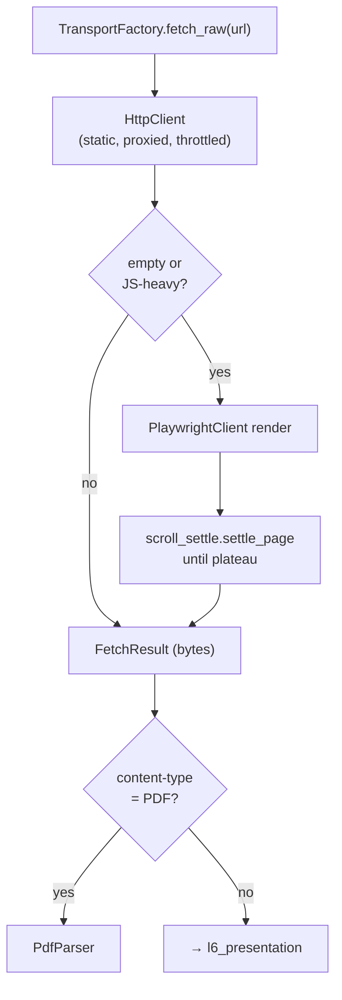
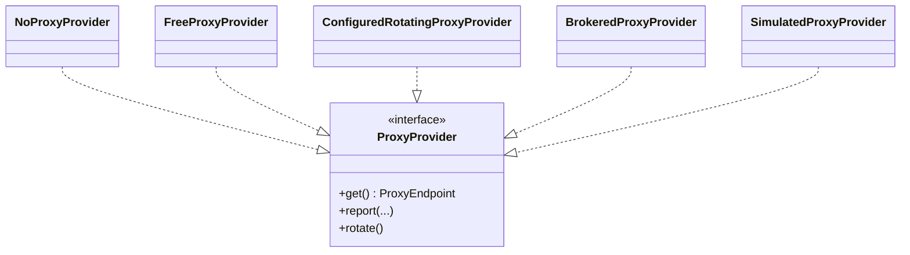

# `l4_transport/` — Transport Layer (get the bytes)

Fetches raw content politely and survives messy portals: realistic headers, throttling,
proxy rotation, JS rendering, and PDF handling. Implements `HtmlFetcherPort`.

## Files

| File | Role |
|---|---|
| `factory.py` | `TransportFactory` — picks static vs dynamic engine (SPA detection) |
| `http_client.py` | `HttpClient` — headers, throttle, proxy, ban/gzip/brotli handling |
| `playwright_client.py` | `PlaywrightClient` — headless render, expand-all toggles |
| `scroll_settle.py` | `settle_page` / `is_settled` — wait for lazy content to plateau |
| `fetch_result.py` | `FetchResult` — immutable bytes-safe response (PDF-safe) |
| `pdf_parser.py` | `PdfParser` — download + extract text (pypdf) |
| `advanced_crawler.py` | `AdvancedCrawler` — static/dynamic + script-tag scanning |
| `proxy_provider.py` | `ProxyProvider` protocol + `ProxyEndpoint` |
| `proxy_providers.py` | None / Free / Configured / Brokered / Simulated providers |
| `proxy_pool_broker.py` | `ProxyPoolBroker` — thread-safe fixed-IP pool for workers |
| `proxy_config.py` | `ProxyConfig` / `FreeProxyManager` |
| `simulated_proxy_server.py` | `ThreadedProxyServer` — residential-IP simulator (test) |
| `demo_crawler.py` | `MockWebServer` + demo harness (test) |

## Fetch decision flow

## Proxy strategy (swappable)

Owned by **Department 01**. See [scraper README](../../../../docs/departments/01-scraper/README.md).
