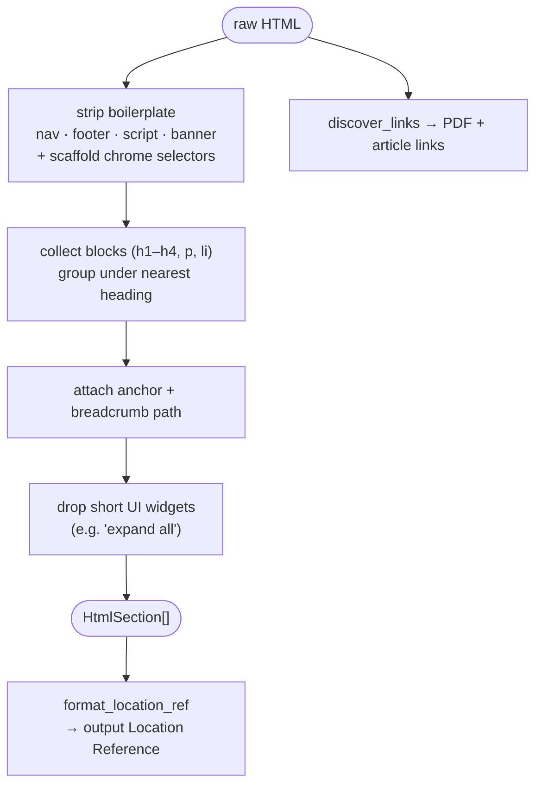

# `l6_presentation/` — Presentation Layer (clean the HTML)

Turns raw HTML into ordered, **anchored, citable** sections and discovers links for crawl
expansion. Pure transformation — no network.

## Files

| File | Role |
|---|---|
| `dom_cleaner.py` | `DomCleaner` — strip boilerplate/chrome, group blocks under headings into sections with anchors + breadcrumb paths, discover links |
| `html_sections.py` | pure helpers: `join_section_text`, `section_for_offset`, `format_location_ref` (the Location Reference field) |

## Cleaning pipeline

The `HtmlSection` shape is the **handoff contract** to Department 02 — do not change it
without coordinating. Owned by **Department 01**
([scraper](../../../../docs/departments/01-scraper/README.md)).
