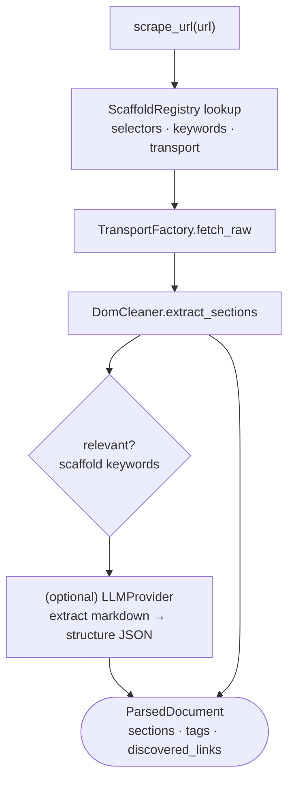

# `l7_application/` — Application Layer (orchestrate one scrape)

Composes L4 transport + L6 presentation + scaffolds (+ optional LLM) into a single
`scrape_url` use case. Implements `DocumentExtractorPort`.

## Files

| File | Role |
|---|---|
| `pipeline_adapter.py` | `PipelineAdapter.scrape_url(url)` → `ParsedDocument`; optional LLM markdown/JSON structuring via injected `LLMProvider` |

## Orchestration

The LLM is the **only AI surface here** and is fully optional — the deterministic path
works without it. Owned by **Department 01**
([scraper](../../../../docs/departments/01-scraper/README.md)).
