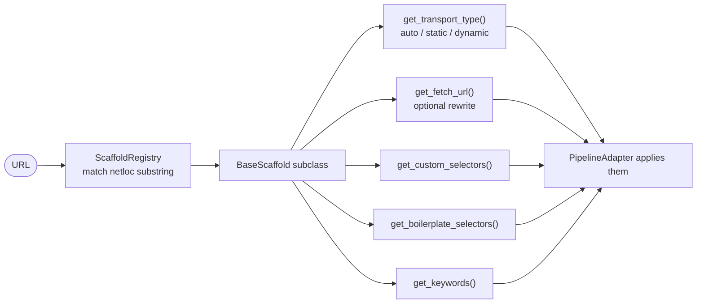

# `scaffolds/` — Site-Specific Portal Rules

Per-domain extraction rules **without touching the core or the L4/L6/L7 layers.** Adding a
new government portal = one new subclass + one registry line.

## Files

| File | Site / role |
|---|---|
| `base_scaffold.py` | `BaseScaffold` ABC — selectors, boilerplate, keywords, transport type, URL rewrite |
| `scaffold_registry.py` | `ScaffoldRegistry` — domain (substring) → scaffold |
| `sso_agc_gov_sg.py` | Singapore Statutes Online (URL rewrite to PDF view) |
| `pdpc_gov_sg.py` | Singapore PDPC |
| `pdp_gov_my.py` | Malaysia PDP |
| `homeaffairs_gov_au.py` | Australia Home Affairs |
| `legislation_gov_au.py` | Australia Federal Register (Angular SPA → forced dynamic) |

## How a scaffold plugs in

To add a portal: subclass `BaseScaffold`, register it, override only what differs, add a
test mirroring `tests/test_legislation_scaffold.py`. Owned by **Department 01**
([scraper](../../../../docs/departments/01-scraper/README.md)).
