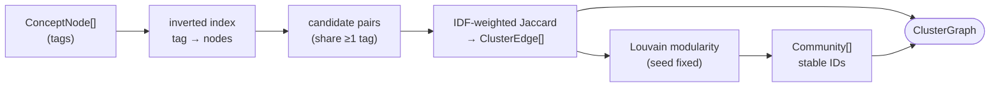

# `adapters/clustering/` — Concept-Graph Builders

Keeps `networkx` / `python-louvain` (both BSD) **out of the core.** Implements the
clustering ports. Deterministic: fixed seed, stable community IDs.

## Files

| File | Role | Port |
|---|---|---|
| `tag_overlap_scorer.py` | IDF-weighted Jaccard edges over `ConceptNode` tags (sparse via inverted index) | `SimilarityScorer` |
| `louvain_communities.py` | Louvain community detection, fixed seed, relabel by smallest member | `CommunityDetector` |

## Graph construction

Orchestrated by `core/pipeline/cluster_pipeline.py`. Owned by **Department 02**
([pipeline-eval](../../../docs/departments/02-pipeline-eval/README.md)).
