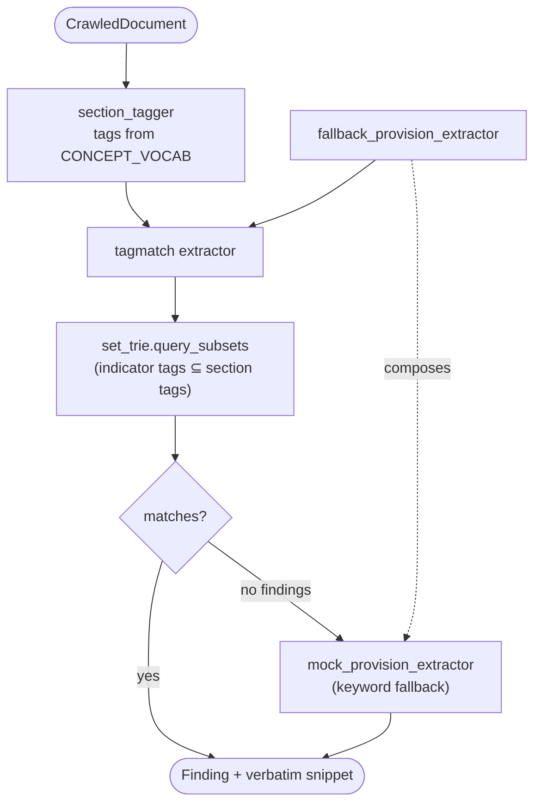

# `adapters/extraction/` — Document → Findings

A family of swappable `ProvisionExtractor` / `SectionExtractor` adapters, deliberately
ranked from **real** to **plumbing-only**. All deterministic; all emit **real verbatim
snippets** (real substrings of the source).

## Files

| File | Strategy | Accuracy |
|---|---|---|
| `tagmatch_provision_extractor.py` | ★ tags → Set-Trie subset query → indicator | high (real substrate) |
| `section_tagger.py` | breadcrumb slugs + concept-vocab phrase tags | feeds the above |
| `structural_extractor.py` | Stage-1 heading-breadcrumb tagging only | low (baseline) |
| `mock_provision_extractor.py` | keyword table + regex article detection | very low (plumbing proof) |
| `fallback_provision_extractor.py` | primary-then-fallback composition | wrapper |
| `text_helpers.py` | pure helpers: title/section/clause derivation | — |

## Extraction flow

Tune accuracy in [`core/domain/indicator_definitions.py`](../../core/domain/README.md),
not in each extractor. Owned by **Department 02**
([pipeline-eval](../../../docs/departments/02-pipeline-eval/README.md)).
