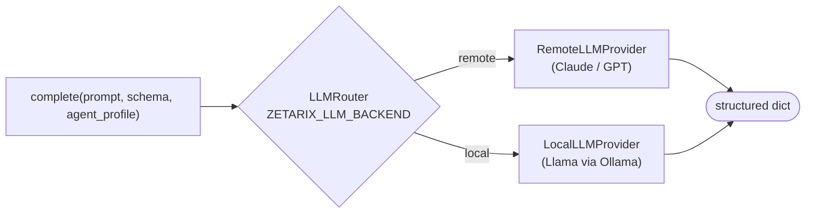

# `adapters/llm/` — The LLM Middleman (only AI surface)

Every LLM call in the system funnels through one router implementing `LLMProvider`. The
**deterministic graph and scoring paths do not depend on this at all** — AI sits strictly
behind this seam, swappable by a single config change.

## Files

| File | Role |
|---|---|
| `router.py` | `LLMRouter` — routes `complete()` to the selected backend; `from_env()` builds it lazily |
| `remote_provider.py` | `RemoteLLMProvider` — hosted API stub (wire Claude/GPT + key here) |
| `local_provider.py` | `LocalLLMProvider` — Ollama / self-hosted stub |

## Routing

> Dev resolves to a paid API; production resolves to open-weight — **no code edits, one
> env var.** This swappability is heavily scored by the rubric.

Owned by **Department 02**
([pipeline-eval](../../../docs/departments/02-pipeline-eval/README.md)).
