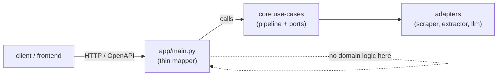

# `app/` — FastAPI Reference Adapter

A **thin, swappable** HTTP layer that maps requests to core use-cases. It holds **no
domain logic** — replacing FastAPI with Litestar (or the CLI with a queue worker) touches
only this folder. The core contract and domain are untouched.

## Files

| File | Purpose |
|---|---|
| `main.py` | FastAPI app. Currently `GET /health` → `{"status": "ok"}`; pipeline routes wired per sprint |
| `__init__.py` | package marker |

## Where it sits

Owned by **Department 03** ([platform-contracts](../../docs/departments/03-platform-contracts/README.md)).
The CLI sibling is `backend/run.py`.
