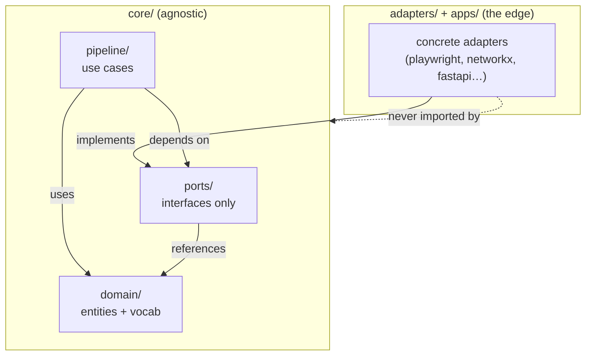

# `core/` — The Agnostic Core

This is the **hexagon**. Everything here is framework-free, tool-free, and
network-free. `core/` depends only on the **ports** (interfaces) it defines — never on a
concrete adapter. FastAPI, Next.js, Playwright, networkx, Claude, Tesseract, Postgres:
none of them may be imported here.

> **The one rule:** if you `import playwright` / `networkx` / `fastapi` / a vendor SDK
> inside `core/`, you are in the wrong folder — that belongs in `adapters/`.

## Sub-packages

| Folder | Responsibility | Detail |
|---|---|---|
| [`domain/`](domain/README.md) | Immutable entities & vocabulary (Finding, Article, ConceptNode, indicator definitions) | The nouns everyone agrees on |
| [`ports/`](ports/README.md) | The interface contracts (Protocols) adapters implement | The seam |
| [`pipeline/`](pipeline/README.md) | Deterministic use cases (tagging, scoring/F1, clustering, retrieval) | The verbs |

## How the layers depend on each other

Dependency direction is **always inward**: adapters → ports → domain. The domain knows
nothing about anything outside itself.

See [docs/departments/](../../docs/departments/) for the delegation view of how these
folders map to owners.
