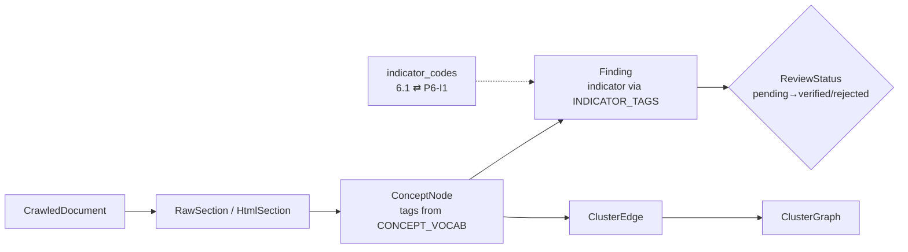

# `core/domain/` — Domain Entities & Vocabulary

Immutable, framework-free dataclasses + the controlled vocabulary that drives tagging.
These are the **nouns** the whole system agrees on. No I/O, no models, no external libs
beyond the standard library.

## Files

| File | What it defines |
|---|---|
| `entities.py` | `Finding` (6 mandatory fields + pillar/indicator/confidence/review status), `Article`, `Pillar` (6\|7), `ReviewStatus`, `DiscoveryTag` |
| `concept_node.py` | `ConceptNode` — a tagged law section; the seed for clustering |
| `cluster.py` | `ClusterEdge`, `Community`, `ClusterGraph` — the concept-graph artifact |
| `document.py` | `CrawledDocument`, `ParsedDocument`, `RawSection`, `HtmlSection`, `DocumentGuide` — handoff types shared with the scraper |
| `access.py` | Compliance/observability entities (`AccessSignal`, `RetrievalPolicy`, `AccessDecision`, audit events) |
| `indicator_codes.py` | Translates DB form `6.1` ⇄ canonical `P6-I1` |
| `indicator_definitions.py` | **Source of truth:** `CONCEPT_VOCAB` (concept → trigger phrases) + `INDICATOR_TAGS` (indicator → required concept set) |

## How a section becomes a scored Finding (where these entities live)

## Design contract

- **Immutable** — entities are frozen dataclasses; transformations return new copies.
- **Change accuracy here, not in adapters** — tune `indicator_definitions.py` rather than
  editing a dozen extractors.
- Owned by **Department 02** ([pipeline-eval](../../../docs/departments/02-pipeline-eval/README.md)).
