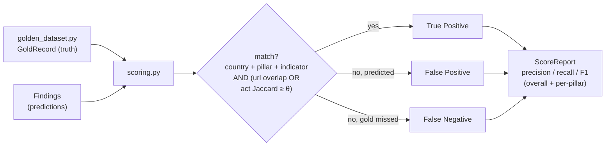
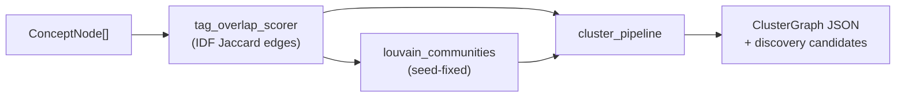

# `core/pipeline/` — Deterministic Use Cases

The **verbs**: orchestration logic that takes ports as dependencies and produces
artifacts. Everything here is deterministic — fixed ordering, no RNG, no clock, no
network. If a change makes a test non-reproducible, it is wrong by definition.

## Files

| File | Responsibility | Owner dept |
|---|---|---|
| `scoring.py` | ★ **F1 harness** — precision/recall/F1 of predictions vs gold | 02 |
| `cluster_pipeline.py` | `build_clusters` → `ClusterGraph` → deterministic JSON + discovery candidates | 02 |
| `guided_tagging.py` | high-context guide + low-context section tagging + reconciler | 02 |
| `compliant_retrieval.py` | policy-gated fetch + audit trail | 02 |
| `document_validator.py` | LLM-backed document validity check | 02 |
| `set_trie.py` | Set-Trie subset/superset index (tags only, acyclic) | 02 |
| `parallel_matcher.py` | parallel matching over the Set-Trie | 02 |
| `ocr_cer.py` | OCR Character Error Rate harness (<5% target) | 02 |
| `output_emitter.py` | **13-column CSV contract** + law-grouped JSON envelope | 03 |
| `golden_dataset.py` | loads ESCAP Round 1/2 workbooks + seed CSVs → `GoldRecord` | 03 |
| `scraper_orchestrator.py` | wires extractor + validator into a scrape run | 03 |

## The scoring loop (the keystone)

## The graph path

Mixed ownership: scoring/tagging/clustering = **Dept 02**; output contract + gold +
orchestrator = **Dept 03**.
