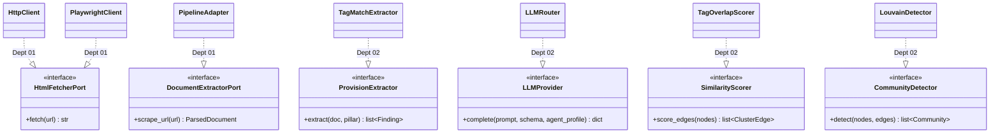

# `core/ports/` — The Interface Seam

`typing.Protocol` interfaces only. **No implementations. No external libraries.** This is
the single contract every adapter plugs into and the only surface the agnostic core
exposes. *A swap = changing one factory/config entry.*

> Adding or changing a method here is a **cross-department breaking change** — find every
> implementer (Dept 01/02/04) and update them in the same PR. Requires lead review.

## Files & contracts

| File | Ports | Implemented by |
|---|---|---|
| `__init__.py` | `DocumentSource`, `OCREngine`, `Chunker`, `VectorStore`, `DocumentExtractorPort`, `ProvisionExtractor`, `HtmlFetcherPort`, `LLMProvider`, `IndicatorClassifier`, `FindingRepository` | 01, 02 (some open/extensible) |
| `extraction.py` | `SectionExtractor`, `DocumentGuideProvider`, `GuidedSectionTagger`, `TaggingReconciler` | 02 |
| `clustering.py` | `SimilarityScorer`, `CommunityDetector` | 02 |
| `access.py` | `AccessObserver`, `AccessPolicyEvaluator`, `RetrievalAuditor` | 02 |

## Who implements what

Owned by **Department 03** ([platform-contracts](../../../docs/departments/03-platform-contracts/README.md)).
