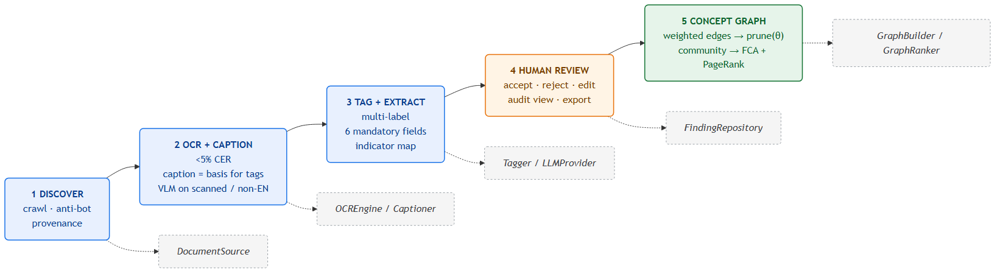

# Technical Memo — Zetarix

*Team **Arkova** · Global Hackathon on AI for Digital Trade Regulatory Analysis (UN ESCAP & KMITL, 2026). Apache 2.0.*
*Companion deck covers walkthrough; this memo = 2-page technical summary.*

**Problem.** Automate ~80% of the RDTII workflow (discover → describe) for **Pillar 6 (Cross-border
Data Flows)** and **Pillar 7 (Domestic Data Protection)** at article-level granularity, with a
transparent 20% human-review step. **Model-agnostic by design** — every model is a swappable adapter.

## Pipeline

*Stages 1–5 with the ports they bind to (dashed). Adapters are config-selected; the core domain depends on the ports only. Source: `pipeline.mmd` (Mermaid).*

**6 mandatory fields / article:** `title · last_update · url · scope · provisions · impact`
(+ pillar, indicator, confidence, review_status). Document-level summaries rejected.

**Stage 5 (core contribution).** Tagged nodes seed **two parallel artifacts**:
(a) a **concept graph** — start from the complete pairwise graph, then *subtract* edges
where `w = α·IDF-Jaccard(tags) + (1−α)·cosine(emb)` falls below a **calibrated θ**
(fixed seeds + θ ⇒ reproducible). Community detection (Louvain) + weighted **PageRank** rank
influence within the surviving web. (b) a **generality tree** via **Formal Concept Analysis**
on the node×tag matrix (algebraic taxonomy induction — alternative to hLDA, chosen for
determinism + audit). Lattice depth = specificity (more tags ⇒ fewer matching sections ⇒
deeper). Together: an entry-point category opens into PageRank-ranked subcategories — the
navigable cross-jurisdiction evidence layer.

## Architecture — ports & adapters

Core domain imports no framework/model SDK; concrete tools are config-selected adapters.

| Port | Suggested adapter (dev) | Open-weight target | License |
|---|---|---|---|
| `DocumentSource` | Playwright + BeautifulSoup | same | BSD/MIT |
| `OCREngine` | Tesseract 5 + OpenCV / PaddleOCR | same | Apache-2.0 |
| `Captioner` | Qwen2-VL / ColQwen2 | same | Apache-2.0 |
| `Tagger` (embeddings) | BGE-M3 + reranker | same | MIT/Apache |
| `VectorStore` | pgvector / Chroma | same | PostgreSQL/Apache |
| `LLMProvider` | Claude / GPT | Llama 3.1 8B/70B via Ollama | Apache-compat |
| `GraphBuilder`/`Ranker` | NetworkX + FCA `concepts` | same | BSD/MIT |

> ⚠️ **License discipline:** ColQwen2 over PaliGemma/ColPali (Gemma); NetworkX/Louvain over GPL
> `leidenalg`/`igraph`; no CC-BY-NC models. All components Apache-2.0-compatible.

## Cost per 50-page document *(preliminary)*

~200 article-level chunks / 50-pp doc.

| Configuration | Total / 50 pp |
|---|---|
| Open-weight (Llama 3.1 8B, self-host GPU) | **~USD 0.05–0.10** (API: $0.00) |
| API (Claude/GPT) | **~USD 0.10–0.25** |

Open-weight basis: A10G-class GPU at batch rates. Final CER / latency / cost reported post-test.

## Generalisation, fine-tuning, originality

- **Generalisation:** no per-country retraining; non-English via captioning + translation;
  scanned PDFs via OCR (<5% CER); compliant access handling on messy portals via headless browser + approved archive fallback.
  Target ≥3 of 10 assigned countries at finale.
- **Fine-tuning *(planned)*:** few-shot tune small encoder/classifier for Pillar 6/7 sub-indicators
  using RDTII taxonomy; θ calibrated F1-optimal on RDTII labelled data. Weights published in repo.
- **Originality:** not a new model — a complete, deployable, open-source RDTII pipeline that does
  not yet exist, with a concept-graph layer for cross-jurisdiction evidence discovery.

**Deploy:** `docker-compose up` → api + web + Postgres/pgvector. No proprietary production
dependency. Full design: `docs/ARCHITECTURE.md`, `docs/GRAPH_PIPELINE.md`.
