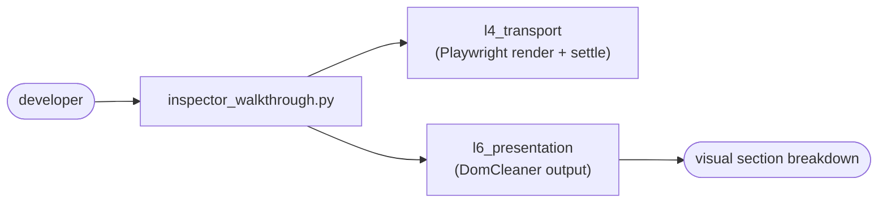

# `tools/` — Developer & Debug Utilities

Standalone scripts for inspecting and debugging the scraper stack. Not part of the runtime
pipeline — they help developers see what the scraper sees.

## Files

| File | Purpose |
|---|---|
| `inspect_dom.py` | Dump the cleaned DOM / sections for a URL |
| `inspector_render.py` | Render a page (headless) for inspection |
| `inspector_walkthrough.py` | Live `--walkthrough` debugger for lazy-load / SPA portals |

## Where they hook in

Use these when a portal under-renders or sections collapse — they make the L4/L6 behavior
observable. Related to **Department 01**
([scraper](../../docs/departments/01-scraper/README.md)).
