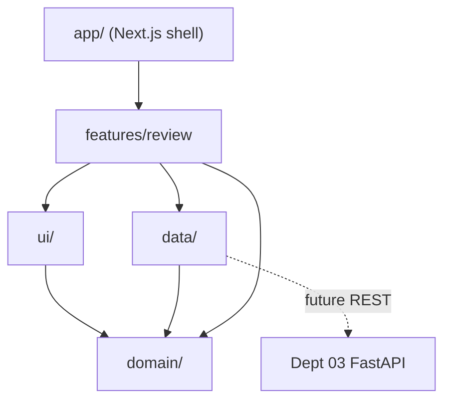

# `frontend/src/` — Reviewer UI Source

Layered React/TypeScript source for the Zetarix review console. Strict inward dependency
direction: **UI → Features → Data → Domain.** No layer reaches back up.

## Layers

| Folder | Layer | Responsibility |
|---|---|---|
| [`domain/`](domain/README.md) | domain | framework-free types (`Finding`, `Pillar`, `ReviewStatus`) |
| [`data/`](data/README.md) | data | `FindingsRepository` port + mock/REST adapters (swap point) |
| [`features/review/`](features/review/README.md) | feature | container hook + console composition + pure filters |
| [`ui/`](ui/README.md) | ui | stateless presentational primitives |
| `styles/` | styling | `globals.css` (resets/type) + `review.css` (console layout) |

## Dependency direction

Owned by **Department 04** ([frontend-reviewer](../../docs/departments/04-frontend-reviewer/README.md)),
agent `zx-frontend`.
