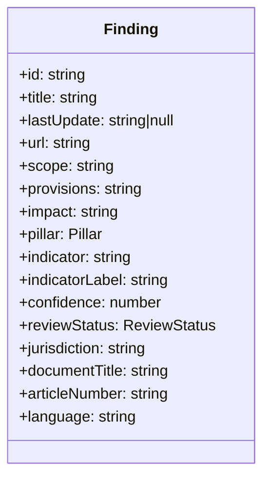

# `src/domain/` — Frontend Domain Model

Framework-free TypeScript types that mirror the backend `core/domain/entities.py`. No
React, no data fetching — pure shape. Every component derives from these.

## Files

| File | Defines |
|---|---|
| `finding.ts` | `Finding` (6 mandatory fields + mapping metadata + audit context), `Pillar = 6 \| 7`, `ReviewStatus = pending \| verified \| rejected`, `PILLAR_LABEL` |

## The `Finding` shape

> When the backend finding shape changes, **this is the one file to update** — coordinate
> with Department 03 (it must stay in sync with `entities.py` + the output columns).

Owned by **Department 04** ([frontend-reviewer](../../../docs/departments/04-frontend-reviewer/README.md)).
