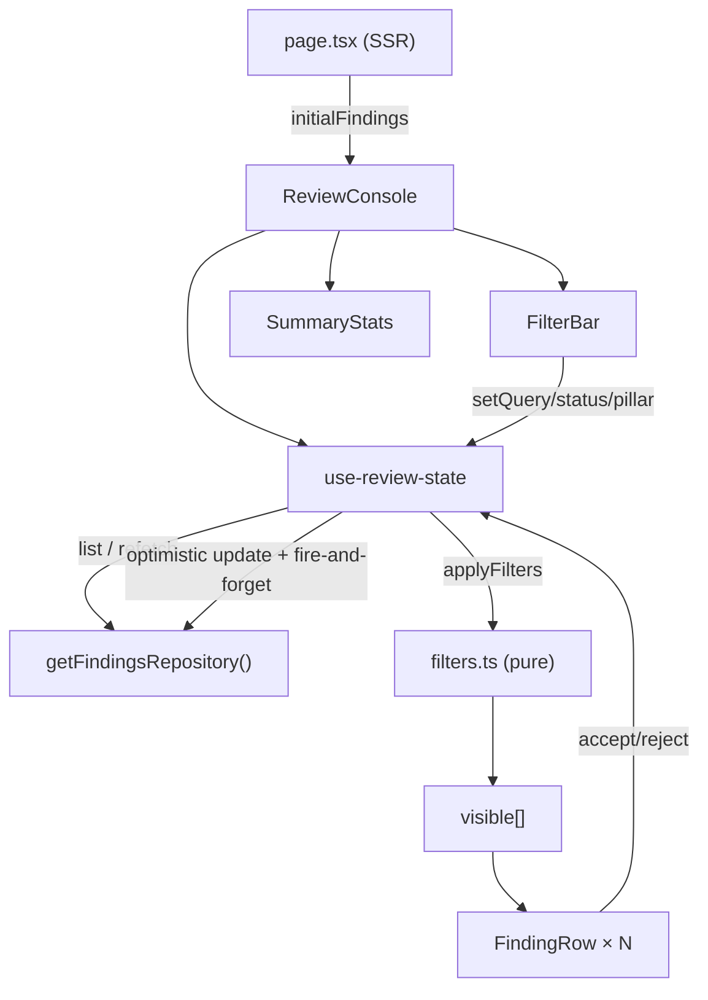

# `src/features/review/` — The Review Feature

The human side of the 80/20 split: a fast console where a researcher verifies, rejects, or
edits findings. Container/presentational split — state lives in one hook, the rest is pure
rendering.

## Files

| File | Role |
|---|---|
| `ReviewConsole.tsx` | root client component; composes the feature |
| `use-review-state.ts` | container hook: findings + repository lifecycle + optimistic review |
| `filters.ts` | pure filter logic (no React) |
| `FilterBar.tsx` | search input + status/pillar chips |
| `FindingRow.tsx` | expandable row + accept/reject/edit + source link |
| `SummaryStats.tsx` | counts + review progress (and F1/coverage once wired) |

## State & render flow

Dependency direction: **UI → Features → Data → Domain** (never reversed). Owned by
**Department 04** ([frontend-reviewer](../../../../docs/departments/04-frontend-reviewer/README.md)).
