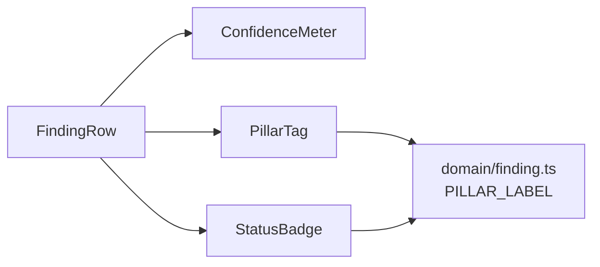

# `src/ui/` — Reusable UI Primitives

Stateless, presentational components with **no data knowledge** and no side effects. They
define the review console's design language and are composed by `features/review/`.

## Files

| File | Input → output |
|---|---|
| `ConfidenceMeter.tsx` | `value: 0..1` → bar + % (color by level: high ≥80%, mid ≥65%, low <65%) |
| `PillarTag.tsx` | `pillar: 6\|7` → "P6/P7" badge + full label (via `PILLAR_LABEL`) |
| `StatusBadge.tsx` | `status` → colored dot + label (pending/verified/rejected) |

## Composition

Pure props in, markup out — safe to reuse anywhere. Owned by **Department 04**
([frontend-reviewer](../../../docs/departments/04-frontend-reviewer/README.md)).
